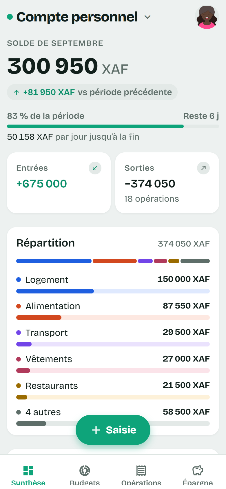
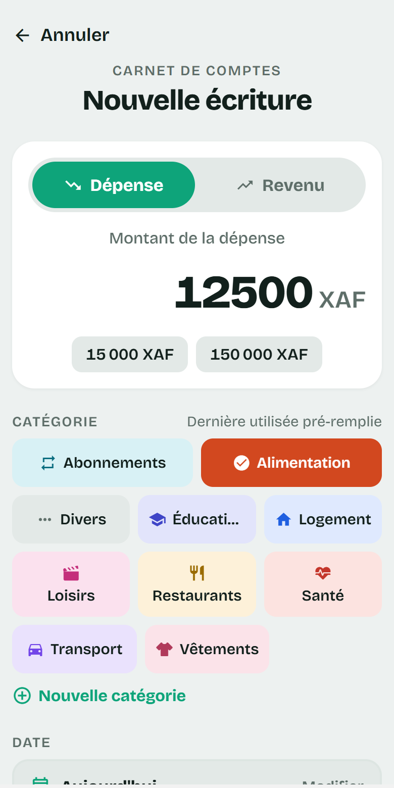
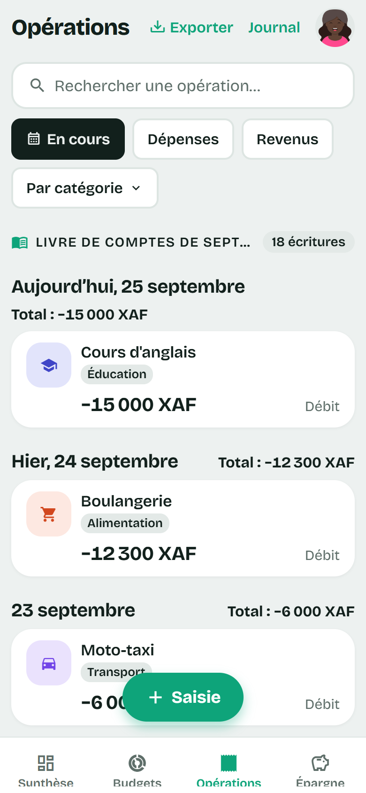
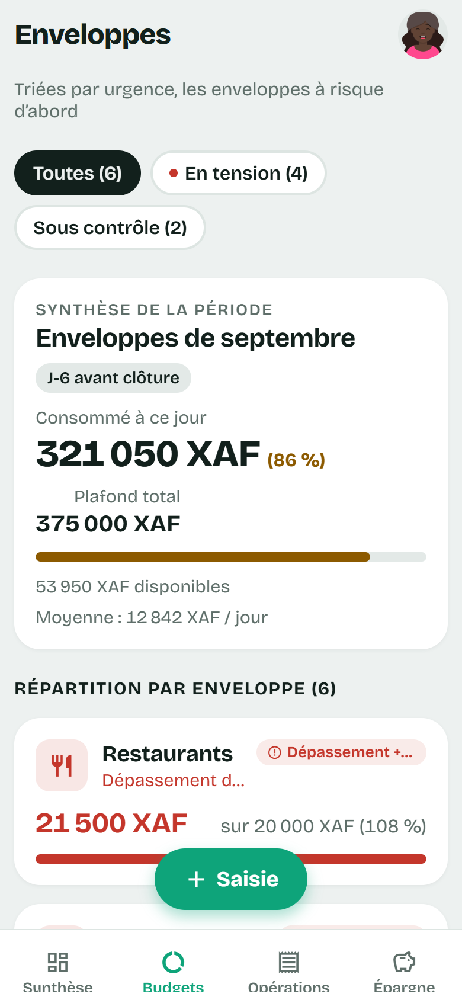
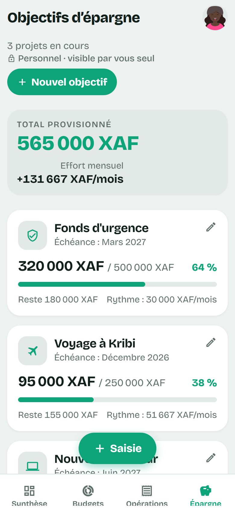
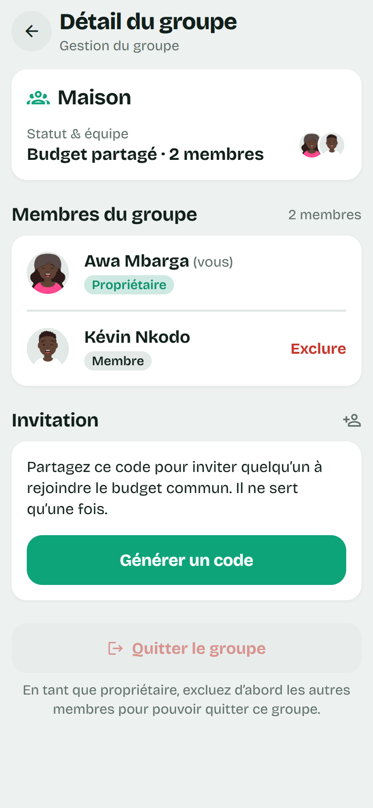

# Wazu Finance

**Wazu Finance est une application mobile pour suivre son argent, seul ou à plusieurs.**

Chaque personne dispose d'un compte personnel, visible d'elle seule. Elle peut aussi tenir un budget commun avec d'autres : en couple, en famille ou en colocation. Chacun y note ses dépenses, et tout le monde voit les mêmes chiffres, mis à jour en direct.

Les montants sont en francs CFA (FCFA), sans centimes : l’app vaut pour le XAF d’Afrique centrale comme pour le XOF d’Afrique de l’Ouest, de même valeur.

## Aperçu

<!-- markdownlint-disable MD033 -->
<table>
  <tr>
    <td align="center" width="33%"> <b>Synthèse</b> : le mois en un coup d'œil</td>
    <td align="center" width="33%"> <b>Saisie</b> : montant, catégorie, valider</td>
    <td align="center" width="33%"> <b>Opérations</b> : l'historique, jour par jour</td>
  </tr>
  <tr>
    <td align="center"> <b>Budgets</b> : les plafonds et leurs alertes</td>
    <td align="center"> <b>Épargne</b> : la progression des objectifs</td>
    <td align="center"> <b>Groupe</b> : un budget partagé à deux</td>
  </tr>
</table>

Captures réalisées avec des données fictives.
<!-- markdownlint-enable MD033 -->

## Ce que fait l'application

### Noter une dépense en trois gestes

Depuis l'écran d'accueil, le bouton **Ajouter** ouvre le formulaire : on tape le montant, on choisit la catégorie, on valide. La date du jour et la dernière catégorie utilisée sont déjà remplies, et restent modifiables. On peut aussi noter un revenu, ajouter une note ou des étiquettes (« Rentrée 2027 », « Argent de Jean »), puis corriger ou supprimer une opération plus tard.

### Voir où en est son mois

L'écran **Synthèse** résume la période en cours :

- le solde, c'est-à-dire les revenus moins les dépenses ;
- la différence avec la période précédente ;
- la répartition des dépenses par catégorie, en barres ;
- les dernières opérations.

S'y ajoutent, quand ils ont lieu d'être : les opérations récurrentes arrivées à échéance, le solde de chaque portefeuille, les prêts et dettes en cours, et une carte **Commerce** (ventes, achats de stock, marge) dès que la période contient une vente ou un achat de stock.

Le mois budgétaire n'a pas besoin de commencer le 1er : on choisit le jour qui correspond à sa paie, du 1 au 28.

### Retrouver une opération

L'écran **Opérations** liste tout l'historique, jour par jour, avec le total de chaque journée. On peut le filtrer par période, par type (dépense ou revenu), par une ou plusieurs catégories, par portefeuille et par étiquette, ou chercher un mot.

### Classer ses dépenses

L'application propose des catégories courantes, chacune avec son icône : alimentation, logement, transport, loisirs, santé, etc., ainsi que celles de la vie en zone CFA : tontine, famille, crédit et data, frais mobile money, cérémonies, dons et église, achat de stock. On peut créer les siennes directement dans le formulaire de saisie.

### Fixer des limites avec les budgets

L'écran **Budgets** permet de fixer un plafond de dépenses par catégorie, pour le mois ou pour la semaine. Chaque budget montre ce qui a été dépensé et ce qui reste, et l'application prévient visuellement à deux seuils :

- **à 80 %** du plafond, le budget passe en alerte ;
- **à 100 %**, il est signalé comme dépassé.

Les budgets les plus urgents s'affichent en premier, et une synthèse donne le total dépensé face au total prévu pour le mois. Un budget de la semaine reste sur sa propre carte, puisqu'il ne s'additionne pas à ceux du mois.

### Répartir son argent entre portefeuilles

Espèces, mobile money, compte en banque : chaque opération est rattachée à un **portefeuille**, et chacun a son solde. On passe de l'argent de l'un à l'autre par un transfert, qui ne change pas le solde total ; des frais de retrait éventuels deviennent une dépense « Frais mobile money ». Quand le solde affiché ne correspond plus à la réalité, on l'ajuste au montant réel sans inventer d'opération. Le choix du portefeuille n'apparaît que lorsqu'on en a plusieurs.

### Suivre les prêts, les dettes et les ventes à crédit

L'écran **Prêts et dettes** garde la trace de l'argent prêté à un proche, emprunté, ou d'une marchandise vendue à crédit. Chaque remboursement est noté au fil de l'eau, et l'application calcule ce qu'il reste à rendre ou à recevoir. Un prêt ou un emprunt apparaît sur sa propre ligne dans le solde ; le paiement d'une vente à crédit compte comme une vente le jour où il arrive.

### Ne plus oublier les opérations qui reviennent

Loyer, abonnement, versement de tontine : en saisissant une opération, **Répéter** en fait une opération récurrente, chaque mois ou chaque semaine. Rien n'est enregistré tout seul : le jour venu, elle apparaît en haut de la Synthèse, et on la confirme (en corrigeant le montant si besoin) ou on la passe.

### Mettre de l'argent de côté

L'écran **Épargne** sert à suivre des objectifs : un voyage, un fonds d'urgence, un équipement. Pour chacun, on fixe le montant visé et, si on le souhaite, une date. On y ajoute des versements au fil du temps, et une barre montre la progression. L'application calcule aussi combien mettre de côté chaque mois pour tenir les échéances.

Un versement sort du solde du mois, sur la ligne « épargne », et un retrait l'y fait revenir. Les objectifs d'épargne restent personnels, même à l'intérieur d'un budget partagé.

### Partager un budget

On peut créer un groupe et y inviter d'autres personnes par un **lien** à envoyer sur WhatsApp ou par SMS, ou par le **code d'invitation** qu'il contient. Un code sert à toutes les personnes qui le reçoivent pendant 7 jours ; le propriétaire du groupe peut en générer un nouveau à tout moment, ce qui désactive l'ancien. On invite chacun avec un rôle :

- **membre** : voit tout et saisit des opérations ;
- **lecteur** : voit tout mais ne modifie rien. C'est le fonctionnement d'une tontine : le trésorier tient les comptes, les autres les suivent.

Dans un groupe partagé :

- chaque membre voit les dépenses des autres **en direct**, sans recharger l'application, avec le nom de la personne qui les a saisies ;
- le **journal** indique qui a ajouté, modifié ou supprimé quoi, et quand, y compris les arrivées et départs de membres ; il s'exporte en PDF pour une réunion ;
- le propriétaire gère les membres : il change leur rôle, en retire un, ou passe la main à un autre membre.

Les opérations d'un membre qui quitte le groupe ou supprime son compte restent dans le groupe, à son nom.

On passe d'un groupe à l'autre, ou de son compte personnel à un budget commun, depuis l'écran **Mes groupes**.

### Exporter ses données

Depuis l'écran Opérations, le bouton **Exporter** produit un fichier des opérations affichées, avec leurs filtres :

- en **CSV**, pour les ouvrir dans un tableur (Excel, Google Sheets…) ;
- en **PDF**, pour un relevé lisible, avec les sous-totaux par catégorie, à imprimer ou à partager.

### Continuer sans réseau

L'application reste utilisable sans connexion. Elle affiche les derniers chiffres connus, et les dépenses et remboursements saisis hors ligne sont mis de côté puis envoyés automatiquement au retour du réseau, sans doublon même si la connexion coupe pendant l'envoi. Un bandeau indique qu'on est hors ligne et combien de saisies attendent leur envoi.

### Régler son compte

Dans les **Paramètres**, on peut :

- choisir un avatar parmi dix-sept visages, ou garder ses initiales ;
- changer son nom affiché et son mot de passe ;
- choisir le thème clair, sombre, ou celui du téléphone ;
- régler le jour de début du mois budgétaire ;
- verrouiller l'application par un code à 4 chiffres, et l'ouvrir avec son empreinte ou son visage ;
- télécharger toutes ses données en un seul fichier ;
- relire les conditions d'utilisation et la politique de confidentialité ;
- se déconnecter, ou supprimer définitivement son compte.

À l'inscription, l'adresse e-mail se confirme avec un code reçu par e-mail ; un mot de passe oublié se réinitialise de la même façon. L'application suit aussi la taille de texte choisie dans les réglages du téléphone.

## Confidentialité et sécurité

- **Ce qui est personnel reste personnel.** Une dépense de votre compte personnel n'est visible par personne d'autre. Dans un groupe partagé, seuls ses membres voient ses opérations, et votre adresse e-mail n'est jamais montrée aux autres membres.
- **La protection est assurée par le serveur, pas seulement par l'application.** Même quelqu'un qui contournerait l'application ne pourrait pas lire les données d'un groupe dont il n'est pas membre, ni modifier celles d'un groupe où il n'est que lecteur.
- **Personne ne peut créer un compte avec l'adresse d'un autre** : l'inscription n'aboutit qu'avec le code envoyé à cette adresse. Changer ou réinitialiser son mot de passe déconnecte aussi les autres appareils, au plus tard dans l'heure. Un e-mail prévient dès que le mot de passe ou l'adresse du compte change.
- **La session est rangée dans le coffre-fort du téléphone**, et l'application peut se verrouiller par un code.
- **Presque rien ne reste sur le téléphone après une déconnexion.** Les données gardées pour le mode hors ligne sont effacées ; seules les saisies pas encore envoyées sont conservées, pour partir à la prochaine connexion du même compte, et l'application prévient avant de se déconnecter s'il en reste.
- **Les données sont sauvegardées chaque nuit**, et ces sauvegardes sont chiffrées.
- **Les durées de conservation sont appliquées, pas seulement annoncées** : le journal d'activité, les codes d'invitation expirés et les données techniques sont effacés automatiquement à leur échéance.

Le détail est dans la [politique de confidentialité](https://canteuf.github.io/WazuFinance/legal/confidentialite.html) et les [conditions d'utilisation](https://canteuf.github.io/WazuFinance/legal/cgu.html). Pour supprimer son compte, y compris sans l'application : [procédure de suppression](https://canteuf.github.io/WazuFinance/legal/suppression.html).

## Ce qui n'est pas prévu pour l'instant

Ces fonctions ont été écartées de la première version, chacune pour une raison précise :

- **La connexion automatique à sa banque** : elle demande un intermédiaire payant et une mise en conformité réglementaire. Elle sera étudiée une fois l'application validée par l'usage.
- **Plusieurs devises** : aucun besoin identifié à ce jour, le franc CFA suffit.
- **Les notifications sur le téléphone** : les alertes visibles dans l'application suffisent pour commencer.

## Version actuelle

**Version 1.0.0** : toutes les fonctionnalités ci-dessus sont disponibles. L'application a été installée et testée sur Android (Pixel 7 et Galaxy S21 Ultra).

## Pour les développeurs

L'application est construite avec React Native et Expo, et ses données sont hébergées sur Supabase.

- Installation, commandes, compilation Android, architecture et sauvegardes : [docs/developpement.md](docs/developpement.md)
- Spécification fonctionnelle complète : [spec-app-budget.md](spec-app-budget.md)
- Règles de code et pièges déjà rencontrés : [CLAUDE.md](CLAUDE.md)

## Licence

MIT, voir [LICENSE](LICENSE).
